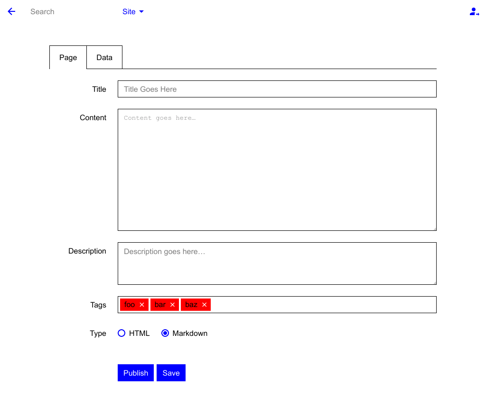

GUI Extension for [Mecha](https://github.com/mecha-cms/mecha)
=============================================================

To activate the control panel feature, you will need to install the [user](https://github.com/mecha-cms/x.user "User") extension as the generic log-in/out system.